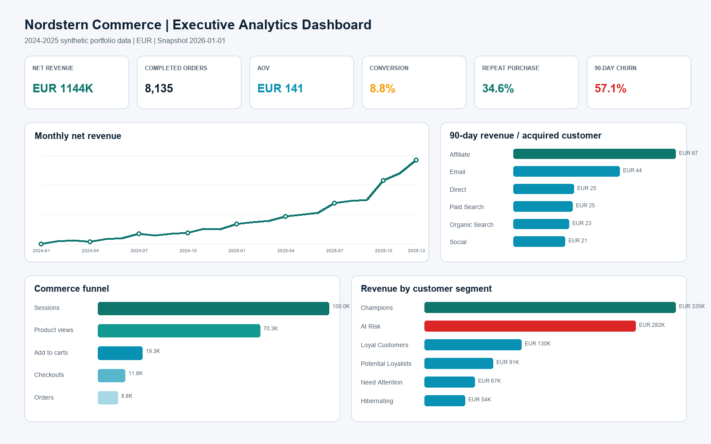
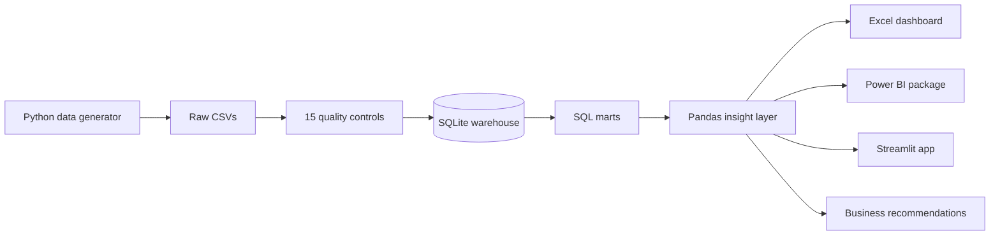

# E-Commerce Analytics & Customer Intelligence

An end-to-end data analyst portfolio project that turns 100,000 e-commerce sessions into commercial decisions with **SQL, Python, Pandas, Power BI, and Excel**.

> **Portfolio scenario:** Nordstern Commerce, a fictional German e-commerce business, wants to understand growth, customer quality, retention, funnel leakage, product economics, and regional performance. The dataset is synthetic, contains no personal data, and is reproducible with seed 42.



## Executive findings

| Finding | Evidence | Recommended decision |
|---|---|---|
| Affiliate acquires the highest-value customers | **€67.06** in 90-day revenue per acquired customer, **123.4% above** the all-channel average | Move 10% of marginal prospecting budget into a controlled Affiliate incrementality test; guard on CAC payback and volume. |
| Social loses the most customers at checkout | **70.0%** checkout-to-order rate, lowest of all channels | Test guest checkout, mobile form simplification, and payment-message clarity. A 2 pp lift is worth about **26 orders / €3.7K** at current AOV. |
| Valuable customers are becoming inactive | **982 At Risk customers** represent **€282K** in historical net revenue | Run a value-based win-back program, personalize by last category, and use a 10% holdout group. |
| Fashion creates disproportionate return risk | **8.7%** average product return rate, highest category | Audit high-return SKUs and improve fit, compatibility, and product-detail content before scaling promotions. |
| The South has the strongest recent momentum | Latest-quarter net revenue grew **82.1%** versus the prior quarter | Validate the winning channel/category mix and align local inventory before increasing regional spend. |

These are decision hypotheses from descriptive analytics. They should be validated through controlled tests before full rollout.

## KPI snapshot

| Net revenue | Completed orders | AOV | Conversion | Repeat purchase | 90-day churn |
|---:|---:|---:|---:|---:|---:|
| **€1,143,543** | **8,135** | **€140.57** | **8.8%** | **34.6%** | **57.1%** |

## Business questions answered

- Which acquisition channels generate the strongest 90-day customer value?
- Where does each channel lose customers in the commerce funnel?
- Which customers are Champions, Loyal, At Risk, or Hibernating?
- How does repeat behavior develop by first-purchase cohort?
- Which categories and SKUs drive revenue, margin, and return risk?
- Which German regions lead revenue, AOV, margin, and recent growth?
- What changed month over month, and what should the business do next?

## Technical scope

- **SQL:** CTEs, window functions, cohort logic, RFM scoring, conditional aggregation, views, indexing, and data-quality checks.
- **Python + Pandas:** deterministic data generation, validation, SQLite warehouse loading, metric reconciliation, insight generation, and dashboard payloads.
- **Excel:** a real formula-driven `.xlsx` with an executive dashboard, native charts, conditional formatting, source analysis tabs, recommendations, and a metric contract.
- **Power BI:** Power Query imports, star-schema relationships, reusable DAX measures, a custom theme, four-page dashboard specification, drill-through, slicer, and validation design.
- **Interactive app:** an optional Streamlit/Plotly dashboard for reviewers who do not have Power BI Desktop.
- **Engineering:** automated tests, GitHub Actions, documented metric definitions, reproducible seed, and a portable SQLite analytical warehouse.

## Repository structure

```text
ecommerce-customer-intelligence/
├── .github/workflows/ci.yml          # Rebuild and test on every push
├── config/project_config.json        # Seed, dates, scale, and company settings
├── dashboard/app.py                  # Optional interactive Streamlit dashboard
├── data/
│   ├── raw/                          # Customers, products, sessions, orders, items
│   ├── processed/                    # SQL/Pandas analytical marts
│   └── warehouse/                    # SQLite database
├── docs/                             # Architecture, metric contract, data dictionary
├── excel/Ecommerce_Analytics_Dashboard.xlsx
├── notebooks/01_customer_intelligence.ipynb
├── powerbi/                          # M queries, DAX, theme, model, report specification
├── reports/                          # KPI summary, QA report, recommendations, preview
├── scripts/                          # User-facing pipeline entry points
├── sql/                              # Analytical SQL scripts
├── src/ecommerce_analytics/          # Generator, quality rules, pipeline
└── tests/                            # Reconciliation and integrity tests
```

## Quick start

### Windows PowerShell

```powershell
python -m venv .venv
.venv\Scripts\Activate.ps1
pip install -r requirements.txt
.\run_project.ps1
```

### macOS / Linux

```bash
python3 -m venv .venv
source .venv/bin/activate
pip install -r requirements.txt
./run_project.sh
```

The pipeline regenerates the raw data, validates it, builds the SQLite warehouse, runs the SQL/Pandas analysis, refreshes processed marts, updates recommendations, and runs the test suite.

To launch the optional interactive dashboard:

```bash
streamlit run dashboard/app.py
```

## Deliverables

- [Excel executive dashboard](excel/Ecommerce_Analytics_Dashboard.xlsx)
- [Business recommendations](reports/business_recommendations.md)
- [Customer intelligence notebook](notebooks/01_customer_intelligence.ipynb)
- [Power BI build package](powerbi/README.md)
- [SQL analysis](sql/)
- [Data dictionary](docs/data_dictionary.md)
- [Metric definitions](docs/metric_definitions.md)
- [Architecture](docs/architecture.md)

### Power BI note

The repository contains everything needed to create the interactive report—Power Query M, DAX, model relationships, theme, page layout, interactions, and validation criteria. A `.pbix` binary is not fabricated by a script because Power BI Desktop must validate local paths and save its proprietary report file. Follow [the Power BI build guide](powerbi/BUILD_GUIDE.md), then save the finished report as `.pbix` or the source-control-friendly `.pbip` format.

## Analytical workflow



## Selected SQL techniques

- `NTILE(5)` window functions for RFM scoring.
- Cohort retention using first-order CTEs and month-offset calculations.
- Customer-acquisition quality using a matured-cohort 90-day revenue window.
- Funnel step rates with `NULLIF` to make denominators safe.
- Product profitability using line-item allocation of order discounts.
- Reusable views and indexes in the SQLite analytical layer.

## Data-quality controls

The pipeline must pass all controls before publishing outputs:

- Primary-key uniqueness across all five tables.
- Customer, order, and product referential integrity.
- Monotonic funnel sequence.
- One-to-one conversion-to-order mapping.
- Order totals reconciled to line items.
- Net-revenue formula reconciliation.
- Valid dates and non-negative financial values.
- Independent SQL audit returning zero failures.

Current result: **15/15 Python checks passed** and **0 SQL audit failures**.

## Metric discipline and limitations

- 90-day acquisition value includes matured customers with zero revenue, avoiding purchaser-only survivorship bias.
- Churn is an operational definition: no completed purchase in 90 days as of 2026-01-01.
- Media cost is not modeled, so channel recommendations use revenue quality—not ROAS or CAC—as the decision signal.
- Regional growth is descriptive and should be checked for channel/category mix before budget action.
- The synthetic data intentionally contains channel, device, category, and loyalty patterns so the project supports realistic business analysis; it is not evidence about a real company.

## Publish to GitHub

```bash
git init
git add .
git commit -m "Build end-to-end e-commerce customer intelligence project"
git branch -M main
git remote add origin https://github.com/YOUR_USERNAME/ecommerce-customer-intelligence.git
git push -u origin main
```

Before publishing, replace `YOUR_USERNAME`, add your name/contact links at the top of this README, and optionally attach the `.pbix` created in Power BI Desktop under Releases if you want to keep the Git history lightweight

## License

MIT — use, adapt, and personalize this project for your own portfolio.

