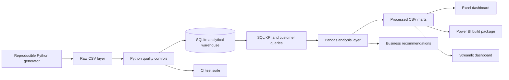

# Solution Architecture

## Design choices

- **Raw → warehouse → marts:** preserves source data, keeps transformations auditable, and mirrors a practical analytics workflow.
- **SQLite:** makes the project runnable without infrastructure while demonstrating portable SQL patterns: CTEs, window functions, conditional aggregation, date arithmetic, and views.
- **Processed marts:** give Excel, Power BI, and Streamlit consistent metric inputs.
- **Metric contract:** definitions are centralized in `docs/metric_definitions.md` and mirrored in SQL/DAX.
- **Reproducibility:** seed 42 plus automated tests produces deterministic results on every run.

