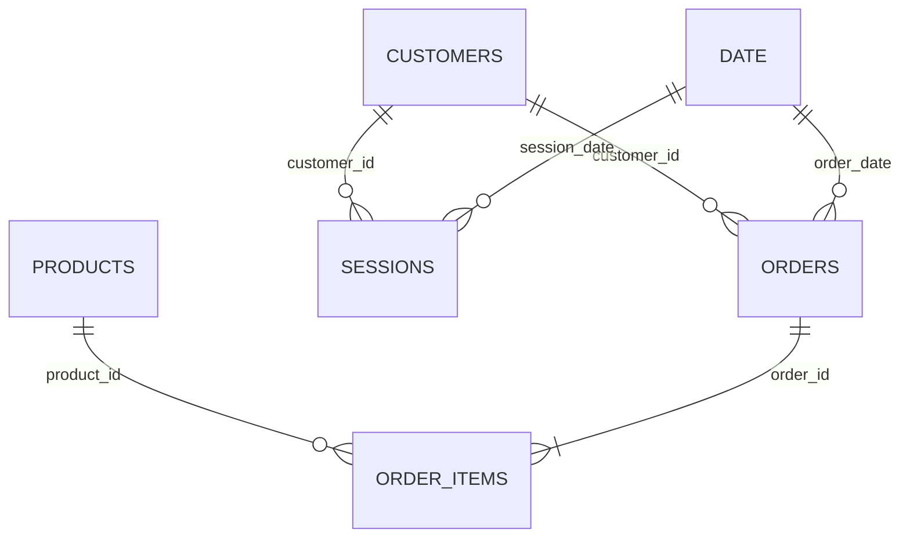

# Data Model

Use single-direction, one-to-many relationships from dimensions to facts.

| From (one) | To (many) | Active | Direction |
|---|---|---:|---|
| `Customers[customer_id]` | `Orders[customer_id]` | Yes | Single |
| `Customers[customer_id]` | `Sessions[customer_id]` | Yes | Single |
| `Products[product_id]` | `Order Items[product_id]` | Yes | Single |
| `Orders[order_id]` | `Order Items[order_id]` | Yes | Single |
| `Date[Date]` | `Orders[order_date]` | Yes | Single |
| `Date[Date]` | `Sessions[session_date]` | Yes | Single |

Hide technical IDs from report view except where they are needed for drill-through. Mark `Date` as the model's date table and sort `Date[Month]` by a numeric year-month column if you add one.

